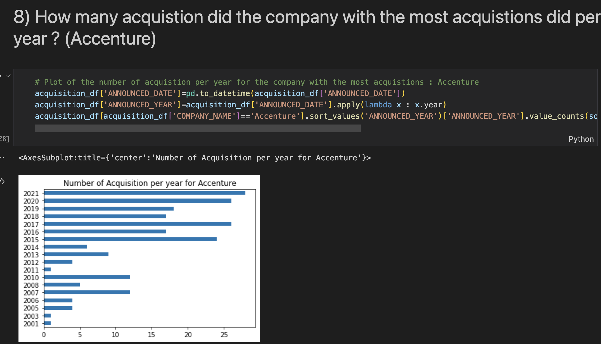

# Analytics with Pandas
- I realized this project during my M2 in order to learn how to handle Python and particularly Pandas in order to pre-process data and analyze them 
- This project aims to manipulate a dataset for analytical purposes. The objective is to answer some analytical questions which requires a work of preprocessing, cleaning, manipulation, conversion, visualization of data
- I mainly used Pandas but also other packages and modules.
- The notebook is structured as follows: 13 analytical questions that I asked myself while observing the dataset followed by the code required to obtain the answer.

- example of the code needed for the question: How many acquisitions did the company with the most acquisitions make per year?